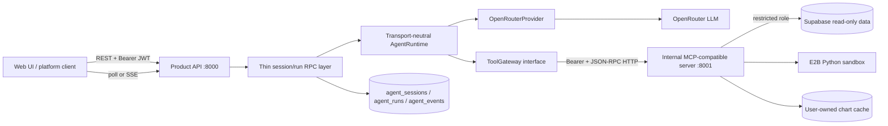

# Celesnity AI Track Submission — Agent Harness

**Candidate project:** Steam Game Data Demo<br>
**Chosen track:** AI — Agent Harness<br>
**Repository:** [github.com/KaoThin280/Steam-Game-Data-Demo](https://github.com/KaoThin280/Steam-Game-Data-Demo)<br>
**Live web application:** [steam-game-data-demo.vercel.app](https://steam-game-data-demo.vercel.app)<br>
**Primary implementation:** [`back_end/app/agent_harness`](back_end/app/agent_harness), [`agent_rpc.py`](back_end/app/api/v1/agent_rpc.py), and [`mcp_server.py`](back_end/app/mcp_server.py)

## Executive summary

I converted an existing Steam analytics chatbot into a bounded, inspectable agent harness. The important change is architectural rather than conversational: the model no longer owns an implicit workflow inside one request handler. A caller creates a durable session, submits a task, receives a run ID, and observes that run through status and event APIs. A transport-neutral agent loop repeatedly calls one real LLM provider and feeds approved tool results back to the model until it produces a final answer or reaches a terminal bound.

The product API and tool execution are separate processes. The API on port `8000` owns authentication, session/run lifecycle, persistence, cancellation and the OpenRouter model adapter. An internal service on port `8001` exposes MCP-style `tools/list` and `tools/call` over authenticated JSON-RPC HTTP. Database access and Python execution exist only behind that tool boundary. PostgreSQL stores sessions, runs and append-only events, so a run can be inspected, resumed in the same conversation, cancelled, or recovered after an API restart.

I deliberately optimized for correctness and explainability on free-tier infrastructure, not horizontal scale. The current deployment uses one API worker and one tool-server worker. This makes cancellation semantics and failure recovery understandable, but a production multi-replica version needs leased queue workers, heartbeats and stronger idempotency. The HTTP tool service is MCP-compatible for this harness, but it does not yet use the official MCP SDK or full Streamable HTTP protocol. I would address those two limitations before claiming general MCP-client interoperability or production scale.

## Architecture and boundaries



The boundaries are intentional:

- **RPC/API boundary:** HTTP knows about authentication and ownership, but not how the model reasons. Replacing FastAPI REST/SSE with gRPC or a queue consumer would not change `AgentRuntime`.
- **Model boundary:** `ModelProvider` returns the project’s own `ModelTurn` type. The loop does not import the OpenAI SDK; only `OpenRouterProvider` does.
- **Tool boundary:** `AgentRuntime` can only list and call tools through `ToolGateway`. SQLAlchemy, E2B and chart persistence do not leak into the loop.
- **Persistence boundary:** `RunStore` owns state changes and append-only events. PostgreSQL, rather than process memory, is the source of truth.
- **Trust boundary:** port `8001` is private and protected by a service secret. User/session/run identity is injected by the authenticated API, not accepted from model-generated arguments.

## Evolution from the original chatbot

| Original project design | Assessment-oriented design |
| --- | --- |
| Chat request owned an implicit end-to-end workflow | Session and run are first-class durable resources |
| Reasoning, provider calls and tool execution were concentrated in AI service classes | Agent loop, provider, tool gateway and persistence use separate project-owned interfaces |
| Tools were effectively implementation details of the backend process | Tools run behind a separately deployable/authenticated HTTP boundary |
| Progress was mainly for UI presentation | Every model/tool/lifecycle boundary is an ordered persisted event |
| Two competing chat workflows and contracts | One frontend workflow uses `/agent-rpc` |
| Restart could lose in-flight work | Graceful interruption requeues work; startup discovers and recovers orphaned runs |
| Chart generation primarily recomputed results | Structured charts are user-owned, persisted and available for lookup/reuse |
| Failures were mostly request-level exceptions/retries | Missing, failed, slow and disconnected tools have explicit contracts and deterministic demos |

The retained Steam domain is useful evidence that the harness is not a toy wrapper: the same runtime supports real read-only data analysis and charting while the failure-injection tools make edge behavior repeatable for assessment QA.

## Assessment requirement mapping

| Assessment requirement | Implementation and evidence | Status |
| --- | --- | --- |
| Create and manage sessions | Create/list/get/rename/delete endpoints in [`agent_rpc.py`](back_end/app/api/v1/agent_rpc.py); ownership checked against the authenticated user | Implemented |
| Send a message/task | `POST /api/v1/agent-rpc/sessions/{id}/tasks` persists a queued run and returns HTTP `202` with a run ID | Implemented |
| Check run status | `GET /runs/{id}` returns structured lifecycle, current/max steps, result, error and cancellation state | Implemented |
| Thin RPC layer and clean core interface | `AgentRuntime` depends on `ModelProvider`, `ToolGateway`, and `RunStore` protocols in [`types.py`](back_end/app/agent_harness/types.py) | Implemented; scheduling/history assembly still lives in the HTTP module and should become an application service |
| Separate MCP server | Independently runnable [`app.mcp_server`](back_end/app/mcp_server.py) exposes `tools/list` and `tools/call` on `8001` | Implemented as MCP-compatible JSON-RPC; official SDK conformance is future work |
| Tool missing/failure/slow/disconnect behavior | Structured `TOOL_NOT_FOUND`, `TOOL_TIMEOUT`, `MCP_DISCONNECTED`; deterministic failure-injection tools and tests | Implemented |
| Build the runtime rather than wrap an agent framework | Hand-written bounded loop in [`runtime.py`](back_end/app/agent_harness/runtime.py); no LangChain/LangGraph agent runtime | Implemented |
| Core types and events | `ToolDefinition`, `ToolCall`, `ModelTurn`, protocols, plus typed lifecycle event names/payloads | Implemented |
| Multi-step agent loop | Model response → tool calls → tool results appended as `tool` messages → next model turn until completion | Implemented |
| MCP integration | Replaceable in-process test gateway and real authenticated HTTP gateway | Implemented within stated compatibility boundary |
| Inspectable execution state | Queued/running/completed/failed/cancelled status, step counter, persisted event sequence and sanitized errors | Implemented |
| Persistent resumable sessions | Completed runs rebuild conversation context; sessions survive restarts; orphaned active runs are requeued and recovered | Implemented for one API worker |
| Store every tool call/event | Model request/response, tool start/result, cancellation, recovery and terminal events stored in `agent_events` | Implemented with payload-size bound |
| One real LLM provider | OpenRouter through `OpenRouterProvider` | Implemented |
| Stream and cancel during demo | SSE event endpoint plus durable cancellation flag and immediate live-task cancellation | Implemented |

## Run lifecycle and failure semantics

```text
queued -> running -> completed
                  -> failed
                  -> cancelled

shutdown while active -> queued -> run.recovered -> running
```

A normal run records events similar to:

```text
run.started
model.requested
model.responded
tool.started
tool.finished
model.requested
model.responded
run.completed
```

Tool results are returned to the model as tool messages. Therefore, an unavailable tool or invalid query is not automatically a fatal run: the model receives a structured error and can correct the call or explain the limitation. Identical successful tool calls are not executed twice in the same run. `AGENT_MAX_STEPS` stops runaway loops, and tool-specific timeouts bound slow dependencies.

Cancellation has two layers. The API first persists `cancel_requested` and the terminal state, then cancels the live asyncio task when it is in the same process. The runtime checks cancellation around model boundaries. During graceful shutdown, an active non-cancelled task is returned to `queued`; startup records `run.recovered` and schedules it again. This is safe for the current read-only data tools and cache-keyed chart writes, but any future side-effecting tool will require an idempotency key and explicit replay policy.

The event stream exposes lifecycle, model output and tool decisions/results—not private hidden chain-of-thought. This provides operational traceability without treating unrestricted chain-of-thought as an API contract.

## MCP tools and the real application use case

The assessment asks for a small mock tool set. The harness includes deterministic failure tools for assessment coverage and a focused real tool set because the host project is a data-analysis product:

- `steam_catalog_overview`: compact catalog counts.
- `describe_steam_table`: schema, descriptive profile and 1–10 sample rows.
- `query_steam_data`: validated read-only SQL; small samples or bounded aggregates.
- `analyze_with_python`: bounded SQL input followed by guarded Python in E2B.
- `monthly_game_releases`: deterministic time-series query and chart.
- `create_chart`: structured interactive chart generation.
- `search_saved_charts` / `get_saved_chart`: reuse previously generated charts.
- `simulate_failure`, `simulate_slow_tool`, `simulate_disconnect`: deterministic edge cases.

The model does not receive full tables. General query results are limited to 10 sample rows; aggregate results and charts are limited to 1,200 points. Python receives at most 5,000 rows/5 MB inside E2B and returns only compact JSON statistics, notes and an optional chart. SQL is checked as read-only in code and also runs through the restricted `steam_readonly` PostgreSQL role. This trades unrestricted exploration for predictable context size, cost and data exposure.

Chart reuse is a deliberate extension of the basic assessment. Chart payloads and source metadata are stored in `ai_chart_history`, scoped with trusted user/run context. The agent searches existing charts before recomputing when cached data is acceptable. The frontend renders the structured payload with Plotly, preserving hover, zoom, range selection and download controls.

## Key design decisions and trade-offs

### 1. Hand-written loop instead of an agent framework

**Benefit:** The stop conditions, message transformation, event ordering, error handling and cancellation behavior are visible in a small amount of code. Provider and tool contracts belong to the application rather than a framework.

**Cost:** I implemented orchestration primitives that a mature framework may already offer. More complex branching, parallel tool calls and checkpoint migrations will require additional work.

### 2. PostgreSQL as the durable source of truth

**Benefit:** Session state, run lifecycle and event traces commit transactionally beside ownership data. Restarts do not erase work, and a reviewer can inspect the exact sequence after the fact.

**Cost:** The SSE implementation currently polls PostgreSQL every 750 ms. This is simple and reliable for a demo, but creates avoidable database load. At scale I would use Postgres `LISTEN/NOTIFY`, Redis Streams or a message broker for wake-ups while retaining PostgreSQL as durable storage.

### 3. REST submission plus polling/SSE

**Benefit:** A task returns `202` quickly; status polling works behind Vercel/proxies, while SSE supports a live demo and persisted replay using event IDs.

**Cost:** This is more endpoint surface than one WebSocket, and cross-process event delivery is not push-native. I selected interoperability and replayability over the lowest-latency transport.

### 4. One worker with in-process task scheduling

**Benefit:** It fits a 1 GB GCP free-tier VM and makes immediate cancellation straightforward. Durable records still allow restart recovery.

**Cost:** In-memory scheduling has no distributed lease. Multiple API replicas could start the same queued run, and a hard crash may leave work queued until startup recovery. The production design needs a worker table/queue with `FOR UPDATE SKIP LOCKED`, lease expiry, heartbeat and idempotent tool execution.

### 5. Independent HTTP tool server, but partial MCP conformance

**Benefit:** Process and network separation prove that tools are not local functions hidden inside the loop. Authentication, timeouts and dropped connections are real boundaries, and the server can be deployed separately.

**Cost:** The current wire contract uses the MCP tool concepts over JSON-RPC HTTP but not the official MCP SDK and full Streamable HTTP lifecycle. It is honest to call it **MCP-compatible**, not a universally compatible MCP server. Migrating the gateway/server adapters should not change the loop.

### 6. Bounded data and remote Python sandbox

**Benefit:** The model sees enough structure to reason without receiving the entire dataset. E2B isolates model-written Python from the VPS, and application/DB-level read-only controls provide defense in depth.

**Cost:** Limits can reject legitimate large analyses, E2B adds latency and dependency cost, and regex-based Python guards are not a security sandbox by themselves. E2B is the actual isolation boundary; the guard is only an early policy filter.

### 7. Persisted chart cache

**Benefit:** Repeated visualization requests can reuse a user-owned chart, reducing database, model and sandbox work.

**Cost:** Cache invalidation is currently basic. Production needs dataset-version keys, expiry/retention policy, provenance and explicit “fresh data” semantics.

### 8. Free-tier deployment choices

**Benefit:** Supabase, Upstash, OpenRouter and E2B remain managed services; the GCP VM runs only one API and one MCP process. This keeps infrastructure understandable and affordable.

**Cost:** External free tiers add variable latency/rate limits. A 1 GB shared-core VM has little headroom, and the current GitHub deployment uses process/background management that should be replaced with `systemd` or containers on a larger host.

## Security and operational controls

- JWT authentication and session/run ownership checks at the API boundary.
- Internal MCP bearer secret; port `8001` binds to loopback on the VPS.
- Separate main and read-only Supabase credentials; the tool role cannot read authentication, RBAC or trace tables.
- Read-only SQL validation, statement/lock timeouts, disabled prepared-statement cache for pooler compatibility and bounded connection pools.
- E2B isolation and bounded Python input/output.
- Maximum agent steps, tool timeouts, one active run per session, event-size bounds and duplicate-tool suppression.
- Sanitized public errors and optional redacted AI-assisted operational email.
- `.env`, logs, credentials and local test accounts are excluded from Git.

Known security work includes event retention/redaction policy, encryption for sensitive traces, per-tool authorization, outbound network allowlists, dependency/container scanning and a stronger secret manager than a VPS `.env`.

## Verification strategy

The unit suite uses fake providers, stores and gateways to verify the boundaries without spending model tokens. It covers:

- multi-step tool results being fed back to the model;
- cancellation before/during execution;
- max-step termination;
- missing-tool feedback and recovery;
- interrupted-run requeue behavior;
- duplicate tool suppression;
- bounded tool schemas, Python policy and trusted context injection;
- database URL normalization for special characters;
- error-notification redaction and deduplication.

GitHub Actions runs the backend tests on Python 3.12. The Windows smoke script exercises the real API, OpenRouter and HTTP MCP service. Its conversation mode creates two independent Vietnamese/English sessions, performs three turns per session, requires real tool events for data questions, validates a complete chart payload and reloads persisted history.

```powershell
.\scripts\test_backend_unit.ps1
.\scripts\test_agent_local.ps1
.\scripts\test_agent_local.ps1 -ConversationSuite
```

## 15-minute demo plan

1. **Architecture (2 min):** show `types.py`, the hand-written loop and the two running services.
2. **Happy path (4 min):** log in, create a session and ask for total games. Show the run ID, live event stream, MCP query and final answer.
3. **Multi-step visualization (3 min):** request a bar chart of monthly game releases. Show saved-chart lookup/query/chart events and the interactive Plotly result.
4. **Persistence (2 min):** refresh the page, reopen the session and ask a follow-up in the same context.
5. **Cancellation (2 min):** start a deliberately slow tool run, cancel it and show the persisted `cancellation.requested`/cancelled state.
6. **Failure behavior (2 min):** request a failure-injection tool or unavailable tool; show the structured error being fed back and the model recovering/explaining it.

The backend-only UI at `/agent-demo` can demonstrate the harness if the product frontend is unavailable. The Next.js UI demonstrates the same `/agent-rpc` workflow with session management and interactive charts.

## What breaks first under production load?

The first bottleneck is not model reasoning; it is orchestration capacity. One process owns live asyncio tasks, SSE polls PostgreSQL frequently, and free OpenRouter/E2B quotas add long-tail latency. More API workers would then introduce duplicate scheduling because there is no distributed lease. Database connection limits and the 1 GB VM become the next constraints.

My upgrade order would be:

1. Move execution to dedicated Postgres-leased workers with heartbeat, retry policy and idempotency keys.
2. Replace polling wake-ups with a broker/notification channel while keeping the event table durable.
3. Adopt the official MCP SDK and Streamable HTTP conformance tests.
4. Separate model/tool concurrency budgets and introduce per-user quotas and cost telemetry.
5. Add OpenTelemetry traces, structured metrics, retention jobs and alert grouping.
6. Move chart/file artifacts to private object storage with provenance and signed download URLs.
7. Add integration, migration, chaos and load tests against real PostgreSQL and a disposable MCP service.

## Scope and honest limitations

This is a functioning assessment implementation, not a claim of production completeness. It supports durable sessions, inspectable runs, multi-step tool use, real LLM calls, an independent network tool service, cancellation, recovery and deterministic failure demos. Its most important limitations are single-worker orchestration, polling-based streaming, incomplete official MCP wire conformance, basic cache invalidation and reliance on free-tier external services. Those constraints were accepted to prioritize visible harness engineering, failure semantics and a demonstrable end-to-end system within the assessment scope.
